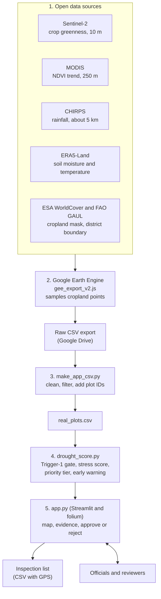
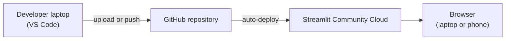

# Drought-Based Smart Subsidy System

Farm-level drought evidence from satellite and rainfall data, so drought relief can reach the farms that need it first.

**Live demo:** https://drought-subsidy-3kscipazcddc8v9i5xlkkm.streamlit.app  <!-- replace with your Streamlit link -->

<!-- Add screenshots after uploading them to a docs/ folder, then remove the comment markers:


-->

## The problem

When drought is declared in Maharashtra, relief is decided for a whole taluka at once. Inside one taluka, some farms lose their crop while neighbours with irrigation do not, and crop-damage surveys are slow and manual.

## What this project does

A screening tool that shows officials **which farms to inspect first, and why**. It does not decide who gets paid. Officials verify every case.

- Scores sampled cropland points in Chhatrapati Sambhajinagar district for Kharif 2026
- Follows the state's Trigger-1 rainfall rule (rainfall deficit above 25%) before scoring
- Gives each plot a drought stress score and a High / Medium / Low inspection priority
- Shows an NDVI trend through the season and an early-warning status
- Interactive map with satellite view and three colour layers
- Approve / reject workflow and a downloadable inspection list with GPS coordinates

## How the score works

Rule-based and explainable, not machine learning.

1. **Trigger-1 gate:** plots in areas with a rainfall deficit of 25% or less are not scored.
2. **Score (0-100)** = 70% NDVI drop score + 30% rainfall deficit score. NDVI 40% below normal and rainfall 60% below normal each score 100.
3. **Priority:** below 50 is Low, 50-69 is Medium, 70 and above is High.
4. **Cloud cover** above 40% flags a plot for manual review.
5. **Early warning:** needs at least 3 clear satellite readings. Worsening means the latest NDVI is more than 10% below normal and at least 5 points lower than recent readings. A trend signal, not a forecast.

All thresholds can be changed with the sidebar sliders.

## Data sources

| Data | Source |
|---|---|
| Crop greenness (NDVI), 10 m | Sentinel-2 (Copernicus) |
| NDVI trend, 250 m | MODIS MOD13Q1 |
| Rainfall, about 5 km | CHIRPS |
| Soil moisture and temperature, about 11 km | ERA5-Land |
| Cropland mask | ESA WorldCover |
| District boundary | FAO GAUL |

All data is accessed through Google Earth Engine.

 ## Architecture

### Data and processing flow



### Deployment



### Components

| Layer | File | What it does |
|---|---|---|
| Data collection | `gee_export_v2.js` | Reads satellite, rainfall and weather layers at sampled cropland points and exports a CSV |
| Data preparation | `make_app_csv.py` | Removes empty and low-vegetation points, adds plot IDs, placeholder farmer names and map zones |
| Scoring | `drought_score.py` | Applies the Trigger-1 rainfall gate, computes the drought stress score, priority tier and early-warning status |
| Interface | `app.py` | Interactive map, evidence panel, approve and reject workflow, downloadable inspection list |
| Hosting | Streamlit Community Cloud | Runs the app from this repository and serves it at a public link |

### Design choices

- **Rule-based and explainable:** officials can see exactly why a farm was flagged. There is no black-box model.
- **Human in the loop:** the tool recommends an inspection priority and officials make every final decision.
- **Free, open data:** no hardware or paid data is needed, and the same method can cover other districts.
- **Graceful fallback:** without `real_plots.csv` the app uses simulated data, and without the trend columns early warning is switched off.


## Repository contents

| File | Purpose |
|---|---|
| `app.py` | Streamlit web app (map, evidence panel, approve/reject, downloads) |
| `drought_score.py` | Scoring and early-warning logic, plus simulated sample data |
| `real_plots.csv` | Prepared data for the district (loaded automatically by the app) |
| `gee_export_v2.js` | Google Earth Engine script that exports the raw data |
| `make_app_csv.py` | Cleans the Earth Engine export into `real_plots.csv` |
| `requirements.txt` | Python dependencies |

## Run it locally

```bash
python -m venv venv
source venv/bin/activate        # Windows: venv\Scripts\activate
pip install -r requirements.txt
streamlit run app.py
```

If `real_plots.csv` is missing, the app falls back to simulated sample data.

## Rebuild the data

1. Sign up for Google Earth Engine (free for non-commercial use).
2. Paste `gee_export_v2.js` into the [Earth Engine Code Editor](https://code.earthengine.google.com) and run it.
3. Start the export in the **Tasks** tab and download the CSV from Google Drive.
4. Run `python make_app_csv.py <downloaded_file>.csv` to create `real_plots.csv`.

## Limitations

- The plots are **sampled cropland points, not real registered farms**. Farmer names, zones and farm profiles are placeholders.
- The thresholds are starting values and have **not yet been validated** against real crop-loss surveys.
- Rainfall, soil moisture and temperature are coarse (5-11 km), so they give area context. NDVI is what separates farms.
- Monsoon clouds leave gaps in the NDVI trend, so some plots show "Limited data". Sentinel-2 and MODIS are different sensors.
- The indicative payout amount is a placeholder, and the savings figure shown in the app is illustrative.

## Roadmap

- Validate against real crop-damage survey results in a pilot taluka
- Connect to land records and the farmer registry
- Add radar data (Sentinel-1) for cloudy weeks
- Field photos and farmer alerts

## Built for

An innovation pitching competition, October 2026.

-Built with help from an AI assistant (Claude). The team chose the problem, the data sources, the scoring rules and the design decisions.
